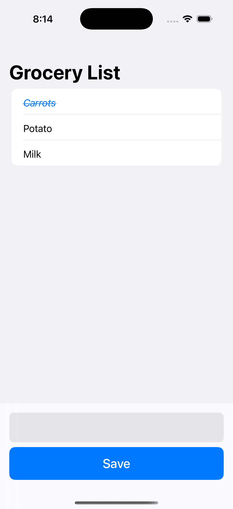
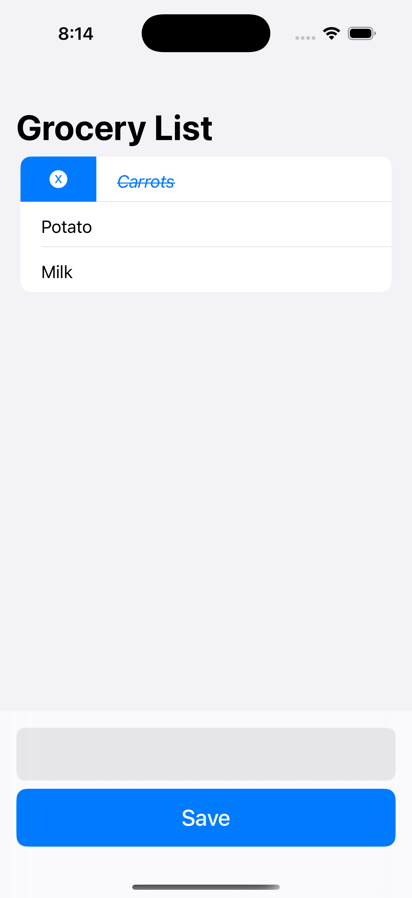

> [!NOTE]
> Tecnologías usadas: Swift, SwiftUI, SwiftData

El objetivo del proyecto es que el usuario pueda gestionar sus compras de manera mas sencilla, la app tiene un diseño simple para facilitar el uso al usuario

Aca podes ver las funciones de la app:

*Vista principal de la aplicación con lista vacía.*

*Vista de agregado de un nuevo alimento.*

*Vista de marcar alimento como comprado mediante swipe.*

*Vista de alimento marcado.*

*Vista de desmarcar alimento como comprado mediante swipe.*

*Vista de eliminar alimento como comprado mediante swipe.*

